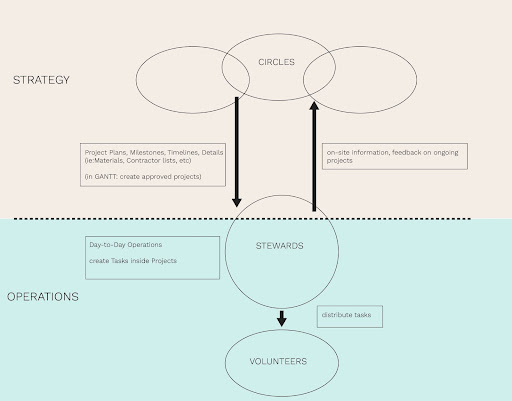

# Circles 🔘

**Circles are decentralised groups of Members who take responsibility for a certain domain.** Circles work together with the team of Stewards on the ground to implement the Masterplan, as shown on the graph below:

At the moment TDF includes the following circles:

- Mission
- Land & Permaculture
- Community
- Architecture
- Legal

Members step into the circle for a period of 3.5 months, aligned with the StewardSHEEP. Circles are expected to suggest a proposal for the roadmap of their cycle including projects they want to execute and token allocation. Each circle (as well as TDF Stewards) selects a delegate. Delegates coordinate activities between circles within the *Coordination Circle.*

Members contributing their energy within a Circle get compensated with tokens.

For more information about each Circle and how to join, please consult our [Pink Paper](https://docs.google.com/document/d/177JkHCy0AhplsaEEYpFHBsiI6d4uLk0TgURSKfBIewE/mobilebasic#h.slung3isnj8q)

