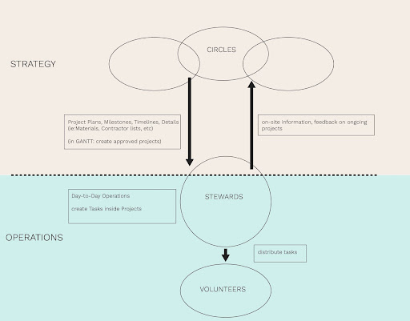

# Stewardsheep

The stewards oversee the evolution of TDF according to the masterplan with the support of the core team. 

The stewards are members that already experienced TDF in multiple facets (building, cooking, hosting, events, etc) and are willing to tend and grow the playground and evolutionary experiment that TDF aims to be.

The Stewardsheep Teams are seasonal following the solar cycle and are based in TDF for 3.5 months, including 2-week overlap for receiving the torch & knowledge from the previous team. They are made up of three people that can comfortably wear and share the three hats that are the pillars of TDF:

- social 
- economic 
- environmental

Stewards get compensated with free stay (food included) for the duration of Stewardsheep (and at cost of food for the rest of the year), tokens, and 20% cash on events and bookings to be divided between the team of Stewards.

The details are outlined in Stewardsheep Invitation drafted individually for each Steward.