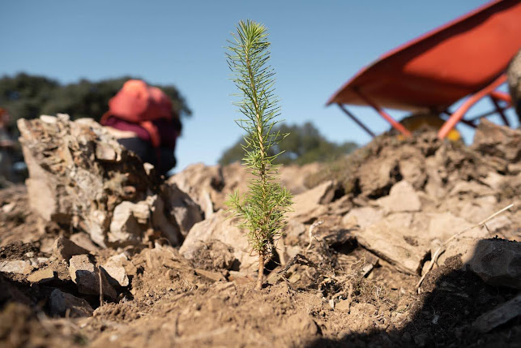

# Visit Traditional Dream Factory
TDF is a regenerative village being built. It is not a luxurious space yet but we put a lot of love into making the best version for this phase of the project to host and inspire you while you can also see and participate in the creative process of something pioneering coming to life.

You can visit TDF as a *guest*, *volunteer* or *member*. The details (including accommodation options, costs, food details, work exchange and how to get to TDF) are outlined in the [TDF Visitors Guide](https://docs.google.com/document/d/198vWYEQCC1lELQa8f76Jcw3l3UDiPcBKt04PGFKnUvg/edit).

**To visit TDF you need to book your stay.**

If you are not a TDF member, fill [this form](https://traditionaldreamfactory.com/signup) to hop on a call with our Community Curator who will provide you with all information you need to know.

If you are a member, you can submit your booking request directly via [this form](https://airtable.com/shruhOwVE3vx4RiD3). Our Stewards will review your request and get back to you.

⚠️ Important: **always book your stay**. ⚠️

If you have any questions, reach out to Bea, our Community Curator ( telegram: @beafonseca )

Traditional Dream Factory is waiting for you 💜.

ps. When you arrive make sure that the Stewards add you to the TDF Today Whatsapp group.